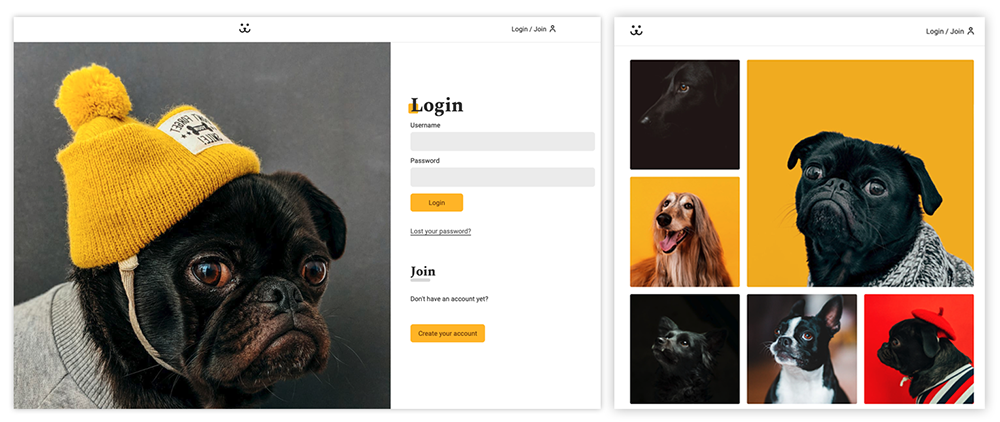

# Social Dogs

## Welcome / Bem vindo!

Thanks for checking out my front-end project. 
🇧🇷/🇵🇹 _Obrigado por conferir meu projeto de front-end._

## Overview

A social network for Dog Lovers! 🐶 Built with React. Share your buddies' photos and interact with other dog owners. 
_Uma rede social boa pra cachorro! Construída com React. Compartilhe as fotos de seu amiguinho e interaja com outros usuários_

## Login Instructions / Instruções de Acesso

Create a new account to access the app or use the following information for a quick login: **Username: dog / Password: dog**.
_Crie uma nova conta para acessar o app ou utilize os seguintes dados para um acesso rápido: Username: dog / Password: dog._

## Project main goals

- Develop a fully functional React App using Vite.
- Learn and practice React Hooks: useState, useContext, useEffect, useCallback and create custom hooks (useData, useForm, etc.);
- Fetch data from a Rest API using async functions and React Lazy / Suspense;
- Build a complete Login section, allowing the user to create a new account, recover the password and remain authenticated.
- Provide a dynamic photo feed with infinite scroll.
- Create a photo upload and a user commentary form.
- Practise the development workflow, using pull requests and merge for updates and adjustments.

## Credits

This project is part of the [Origamid's React JS](https://www.origiamid.com) course.

## Links

- App URL (Deploy): [https://wseguchi.github.io/social-dogs](https://wseguchi.github.io/social-dogs)
- Github Repository: [https://github.com/wseguchi/social-dogs](https://github.com/wseguchi/social-dogs)

## Author

- Wildson Seguchi
- [Github](https://github.com/wseguchi)
- [LinkedIn](https://www.linkedin.com/in/wildson-seguchi/?locale=en_US)
